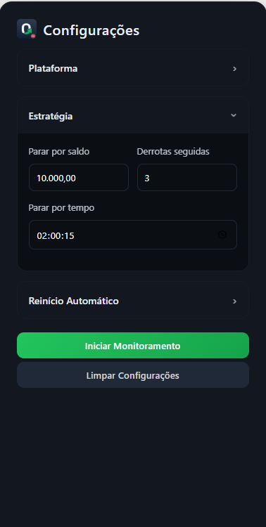
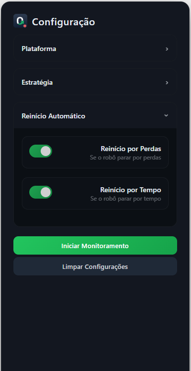
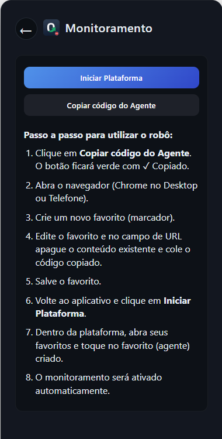
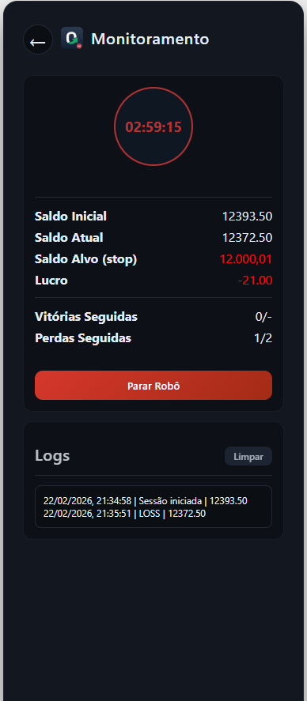

 PWA para monitoramento e controle automático de robô na plataforma Olymp Matix. 
 
    

🔗 Demo

Acesse online:

👉 https://marcos-dev.github.io/olymp-bot/

📸 Preview
 
 
    
    
    
    
 

 <h3 align="center">  
  <a href="#information_source-sobre">Sobre</a> |
  <a href="#rocket-tecnologias">Tecnologias</a> |  
  <a href="#rocket-funcionalidades">Funcionalidades</a> |  
  <a href="#gear-uso">Como Usar</a> |
  <a href="#observações">Observações</a> |
  <a href="#licença">Licença</a> 
</h3>

## :information_source: Sobre

Projeto de um riobô trader em Javascript 
Project for a Javascript trading robot.

## :rocket: Tecnologias

HTML5

CSS3

Vanilla JavaScript

Service Worker (PWA)

Comunicação via postMessage

## :rocket: Funcionalidades

Monitoramento de saldo em tempo real

Controle automático de iniciar / parar robô

Parada por saldo

Parada por perdas seguidas

Parada por tempo

Reinício automático individual por critério

Logs detalhados

Interface responsiva

Instalável como aplicativo (PWA)

## :gear: Uso

Configure os critérios desejados

Clique em Iniciar Monitoramento

Clique em Iniciar Plataforma

Faça login

⭐ Ative o favorito / atalho do agente do robô

Inicie o robô

O lucro é calculado automaticamente:

Lucro = Saldo Atual - Saldo Inicial
📱 Instalação como App
Android (Chrome)

Menu ⋮ → Instalar aplicativo

iPhone (Safari)

Compartilhar → Adicionar à Tela de Início

## :⚠️: Observações

Se a plataforma ou navegador forem fechados, será necessário abrir novamente e ativar o favorito.

O app não altera estratégia, apenas monitora e controla iniciar/parar.

Limitações de reconexão são impostas pelo navegador por segurança.

## Licença
Esse projeto está sob a licença MIT.
